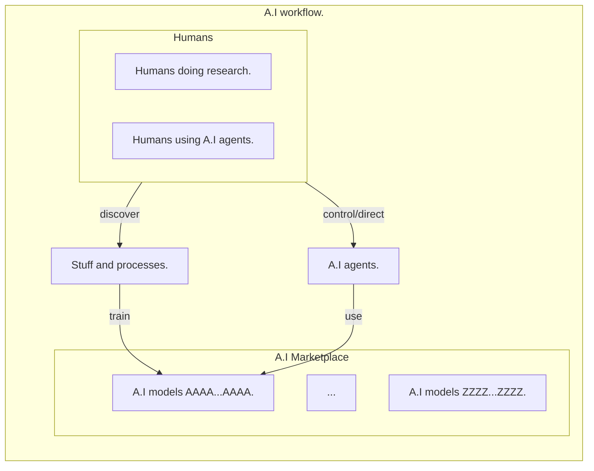
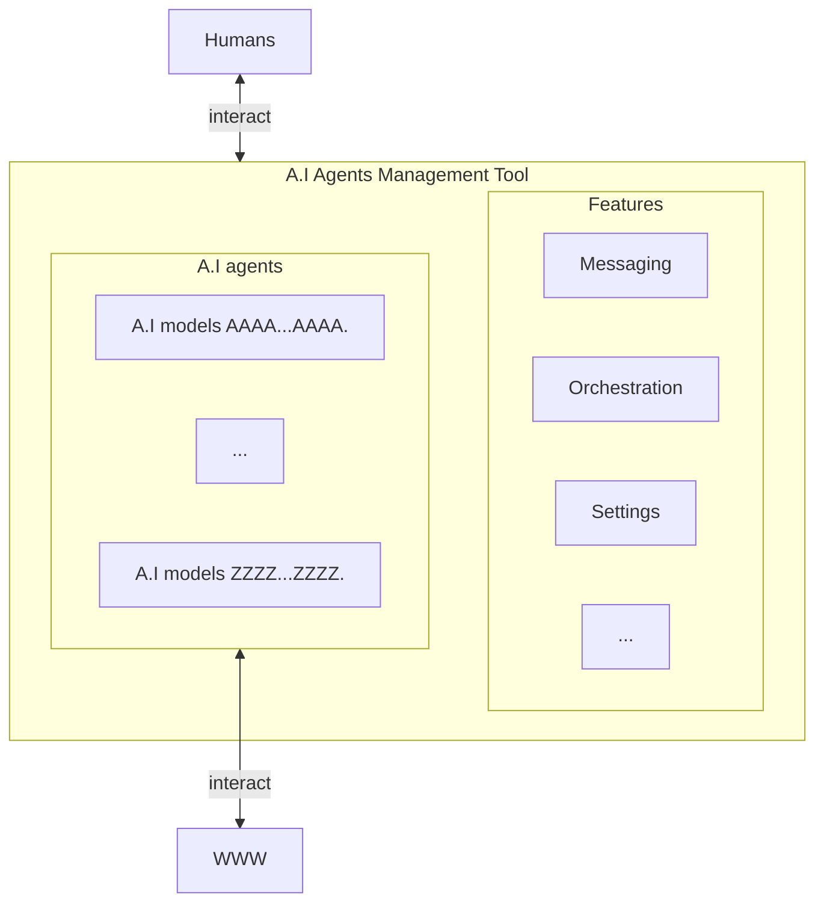

# Online market for AI models

## Table of Contents

- [Abstract](#abstract)
- [Foundation](#foundation)
- [Models for sale](#models-for-sale)
- [Interactions](#interactions)

## Abstract

In a future fueled with A.I agents roaming the internet to perform various tasks,
one thing that we can think of is how capable those A.I agents could be?

The question can be found on the model(s) those A.I agents utilizes.
Having one A.I agent or several ones running different models as an orchestra is something
that people will probably see more in more in the near future.

Based on that, it is obvious that a market of A.I models will soon emerge.
That's what we would like to talk about in this post.

## Foundation

As a foundation, I would like to assume that A.I agent will now become main users (maybe sole users?)
of the internet.

They will be your grandma, brother or sister A.I agent(s) performing various tasks on the internet on their
behalf, a little bit like a buttler (majordome in French).

For payment, you will provide to the A.I agent(s) a pool of money, via a PayPal account for instance.
This can be necessary as we will probably see more and more website making their content accessible only via subscription.
In case you have an A.I agent responsible for providing for instance a summary of all the news about the new tech gadgets,
that agent could access all the major news website via its own account, check all the articles based on your preferences and
make a summary of them to you.

But which website to trust? And how to make sure that the A.I is not led astray by various exploit to led it to report to you
incorrect information?

To all those questions, there is one possible answer, enhance the A.I agent(s) via specialized models.

## Models for sale

Specialized models are models trained in depth for a specific purpose.
Those are models trained for example to detect scientific inacuracies based on our current knowledge.
Or models trained to detect medical illnesses in radiography or to law related issues.

Those specialized capabilities may or may not be already covered by the default model that the A.I agent(s) utilize.
But most likely, companies with deep knowledge will create their model and either lease it (cloud API for accessing it with tokens),
sell it so that people can run it locally on their machine or simply make it open source for anyone to use freely.

Based on that, the idea or concept of a unified marketplace or marketplaces for A.I models is evident.
People or A.I agent would autonomously go to those market and get the A.I model(s) they need for their specific task.

This way, the A.I agent will benefit from that specialized capabilities to better perform its job on the internet.
This is similar to us human when we hire people who are experts in a field to help us make decision, or do a particular task.
With that system in place, we could easily forsee that their would no longer be any space for humans on the internet, at least
as far as deep technical or scientific expertise goes.

All the state of the art in terms of knowledge for a specific field will be consolidated into those specialized models which
will be used by A.I agent to act on behalf of humans being.
Humans will be put back into their different research departments to deepen their understanding of the different things they are
specialized in, in order to feed it into the models that they would later sell or lease.

The following diagram gives a picture of what we are trying to describe so far:

## Interactions

In this model where A.I agents do most of the actual work on behalf of humans, one question we may ask ourselves is
how can humans now interact with the internet.

As we described above, A.I agents will most likely do various tasks as instructed by their owner.
Those tasks can vary from summarizing information, purchasing products or notifying their owner about an important information
he/she may have requested.

If the A.I agent is doing all those tasks, it can inform its owner via a messaging application.
Probably the owner will also be able to control or interact with its A.I agent(s) through a similar mechanism or a more
complex one where the orchestration and management of its A.I agent(s) will be possible.

Of course, in this model, humans can still interact with the internet / world wide web as before,
however this type of interaction will no longer be the primary one since we could see that they would prefer
spend time in the real life doing real thing or instead of doing all the chores they use to do that is now done by
their A.I agents.
